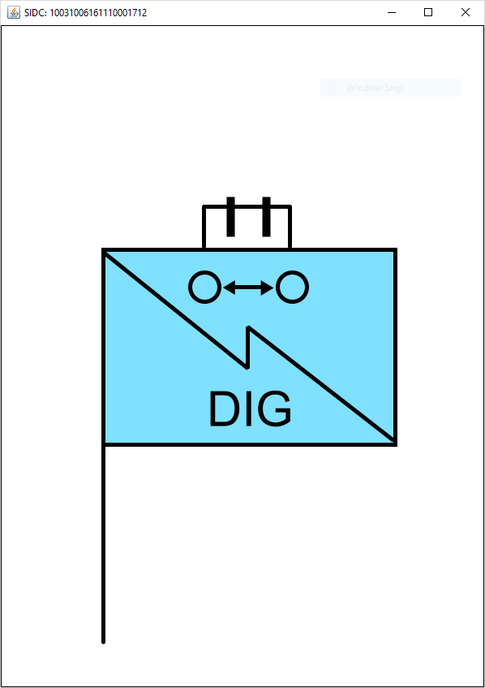

# Joint Military Symbology Java

An experimental [MIL-STD-2525D](http://www.assistdocs.com/search/document_details.cfm?ident_number=114934)/[APP-6](http://en.wikipedia.org/wiki/NATO_Military_Symbols_for_Land_Based_Systems) symbology Java library based on the [ESRI's Joint Military Symbology Markup Language (JMSML)](https://github.com/Esri/joint-military-symbology-xml) 
project.



How it works
------------

The library uses Apache Batik to generate SVg symbols based on


This project is a work in progress. 

Getting started
---------------

    $ git clone https://github.com/yemikudaisi/joint-military-symbology-java.git

Usage
-----
### Basic
To create a basic military symbol
```java
	MilitarySymbol milSym = new MilitarySymbol();
	milSym.setStandardEntityOne(StandardEntityOnes.Reality);
	milSym.setStandardEntityTwo(StandardEntityTwos.Friend);
	milSym.setSymbolSet(SymbolSets.LandUnits);
	milSym.setStatus(Status.Present);
	milSym.setStatusAmplifierMode(StatusAmplifierModes.Default);
	milSym.setHqTFDummy(HQTFDummy.NotApplicable);
	milSym.setAmplifier(BrigadeBelowEchelonAmplifier.Battalion);
	milSym.setEntity(new Entity("11","130000"));
	milSym.setEntityType(new EntityType("10","111100"));
	milSym.setEntitySubType(new EntitySubType("00","111100"));
	milSym.setSectorOneModifier(new Modifier("17","17"));
	milSym.setSectorTwoModifier(new Modifier("12","17"));
	System.out.println(milSym);
    
    //Prints the SIDC code for the symbol -> 10031000161110001712
```


This library provides an alternate Status/OCA modifier with is based on colored bars. To use alternate mode:

```java
	milSym.setStatusAmplifierMode(StatusAmplifierModes.Default);
```

### Amplifiers (Echelon\Equipment Mobility\ Naval Towed Arrays)
Since some amplifiers do not apply to some symbol sets (for example a Naval towed array amplifier cannot be applied to a Land unit symbol set). To dynamically get an array of amplifiers for a symbol set (e.g land units) use:
```java
Amplifier[] amplifiers = MilitarySymbolFactory.getApplicableAmplifiers(SymbolSets.LandUnits)

// returns EchelonAmplifiers.values()
```

To check if an amplifier is applicable to a symbol set:

```java
	boolean isApplicable = MilitarySymbolFactory.isAmplifierApplicable(SymbolSets.LandUnits, EchelonAmplifier.Platoon)
    // returns true
```
